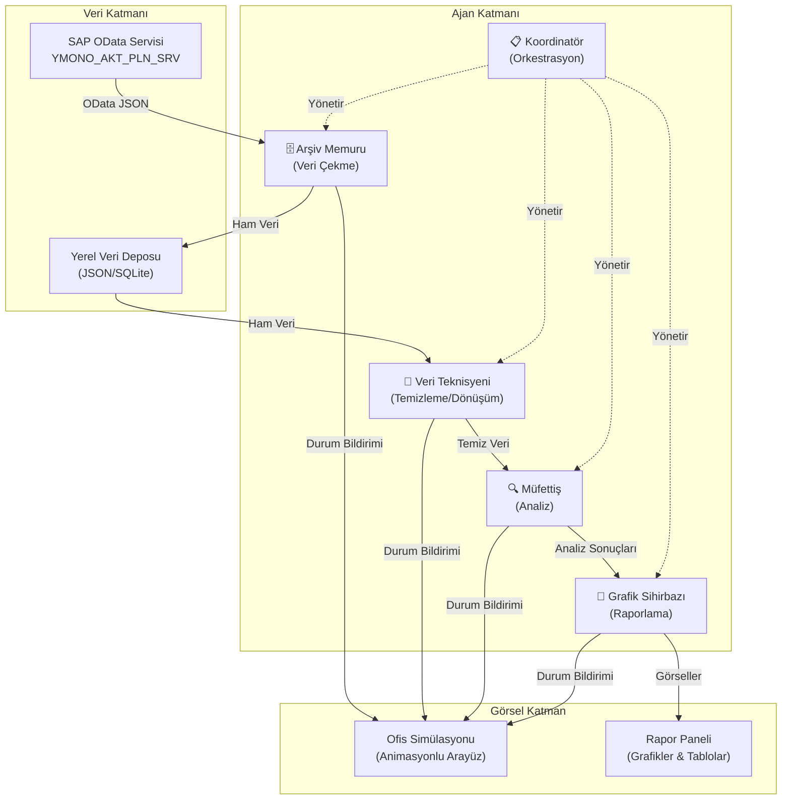
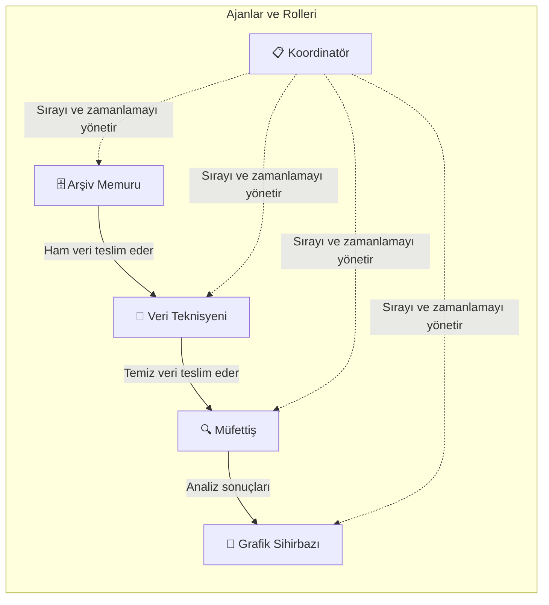
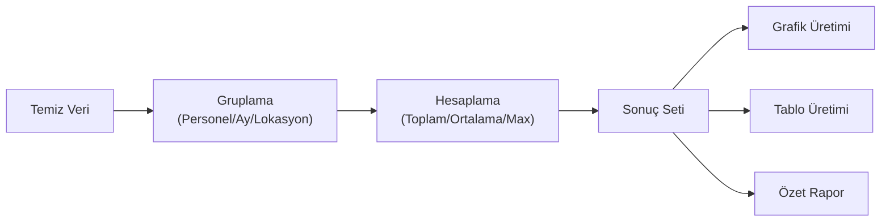
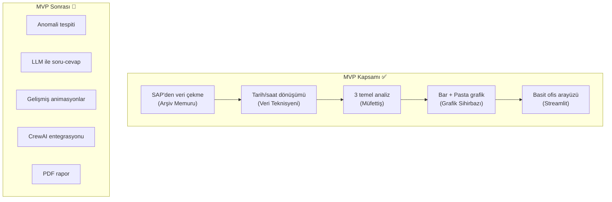
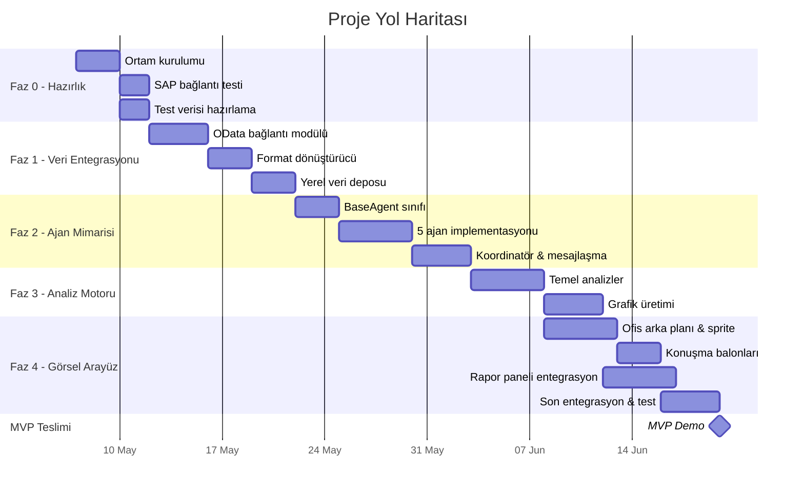

# 🏢 SAP Personel Aktivite Analiz Sistemi — Çok Ajanlı Ofis Simülasyonu

## Proje Vizyonu

SAP'deki personel aktivite (izin/çalışma) verilerini analiz eden, tamamen localhost'ta çalışan, çok ajanlı bir yapay zeka sistemi. Sistem, çizgi film tarzı bir ofis simülasyonuyla kullanıcıya eğlenceli ve izlenebilir bir deneyim sunacak.

---

## 🗺️ Üst Seviye Mimari Görünüm



---

## 📋 Faz Planı ve Yol Haritası

---

### 🟢 FAZ 0 — Hazırlık ve Altyapı (Süre: ~1 hafta)

**Amaç:** Projenin teknik temelini kurmak, geliştirme ortamını hazırlamak.

| # | Adım | Çıktı |
|---|------|-------|
| 0.1 | Python sanal ortamı oluşturma | Temiz, izole bir geliştirme ortamı |
| 0.2 | Proje klasör yapısının belirlenmesi | Modüler ve genişletilebilir dizin yapısı |
| 0.3 | SAP OData erişim bilgilerinin doğrulanması | Çalışan bir bağlantı testi |
| 0.4 | Örnek veri setinin yerel olarak saklanması | Geliştirme sırasında SAP'ye bağımlılığı azaltan test verisi |

**Önerilen Klasör Yapısı:**
```
agent_project/
├── agents/              # Ajan tanımları ve mantığı
├── data/                # Ham ve işlenmiş veriler
├── analysis/            # Analiz motorları
├── ui/                  # Görsel ofis simülasyonu
├── reports/             # Üretilen raporlar
├── config/              # Yapılandırma dosyaları
├── tests/               # Test dosyaları
└── main.py              # Ana giriş noktası
```

> [!TIP]
> SAP'ye her seferinde bağlanmak yerine, ilk çekilen veriyi yerel bir JSON/SQLite dosyasına kaydetmek geliştirme hızını önemli ölçüde artırır. "Arşiv Memuru" ajanı hem canlı SAP hem de yerel önbellek modunda çalışabilmeli.

---

### 🔵 FAZ 1 — SAP Veri Entegrasyonu (Süre: ~1–2 hafta)

**Amaç:** SAP'den veri çekme, dönüştürme ve yerel depolama altyapısını kurmak.

| # | Adım | Çıktı | Bağımlılık |
|---|------|-------|------------|
| 1.1 | SAP OData bağlantı modülü | `requests` ile çalışan, kimlik doğrulamalı bağlantı | Faz 0 |
| 1.2 | OData format dönüştürücü | `/Date(...)` → Python datetime, `PT...` → saat/dakika | 1.1 |
| 1.3 | Veri şeması tanımlama | Her alanın tipi, doğrulama kuralları | 1.1 |
| 1.4 | Yerel veri deposu (JSON veya SQLite) | Verilerin persist edilmesi, tekrar çekilmemesi | 1.2, 1.3 |
| 1.5 | Hata yönetimi ve loglama | Bağlantı kopması, veri hatası gibi durumların yönetimi | 1.1 |

**Bu Fazın Çıktıları:**
- SAP'den veri çekilip yerel dosyaya kaydedilen, çalışan bir pipeline
- OData tarih/saat formatlarının düzgün dönüştürülmesi
- Bağlantı hatalarının zarif şekilde ele alınması

> [!IMPORTANT]
> OData tarih formatı (`/Date(1687737600000)/`) Unix epoch milisaniye cinsindendir. Saat formatı (`PT13H06M58S`) ise ISO 8601 süre formatıdır. Bu dönüşümler Faz 1'de sağlam bir şekilde çözülmelidir çünkü tüm analiz katmanı buna bağlıdır.

---

### 🟡 FAZ 2 — Ajan Mimarisi ve Temel Mantık (Süre: ~2 hafta)

**Amaç:** Çok ajanlı sistemin temel iskeletini kurmak.

#### 2A. Ajan Altyapısı

| # | Adım | Çıktı | Bağımlılık |
|---|------|-------|------------|
| 2.1 | Temel ajan sınıfı (BaseAgent) | Her ajanın uyacağı ortak arayüz | Faz 1 |
| 2.2 | Ajan durum yönetimi | `bekliyor → çalışıyor → tamamlandı → hata` geçişleri | 2.1 |
| 2.3 | Ajanlar arası mesajlaşma mekanizması | Basit bir kuyruk/olay sistemi | 2.1 |
| 2.4 | Koordinatör ajan | İş akışını yöneten orkestratör | 2.2, 2.3 |

#### 2B. Somut Ajanların Tanımlanması



| Ajan | Karakter | Sorumluluk |
|------|----------|------------|
| **Arşiv Memuru** | 🗄️ Gözlüklü, dosya taşıyan memur | SAP'den veri çekme, yerel depoya kaydetme |
| **Veri Teknisyeni** | 🔧 Elinde anahtar tutan tamirci | Tarih dönüşümleri, eksik veri tespiti, temizleme |
| **Müfettiş** | 🔍 Büyüteçli dedektif | İstatistiksel analiz, anomali tespiti, raporlama |
| **Grafik Sihirbazı** | 🎨 Ressam şapkalı sanatçı | Grafik oluşturma, tablo düzenleme, görsel rapor |
| **Koordinatör** | 📋 Takım elbiseli müdür | İş akışı yönetimi, ajanlar arası iletişim |

**Bu Fazın Çıktıları:**
- Çalışan 5 ajan, her biri kendi sorumluluğunu yerine getiriyor
- Ajanlar arası veri akışı sağlanmış
- Koordinatör tüm süreci baştan sona yönetiyor

> [!NOTE]
> **Başlangıç Stratejisi:** İlk versiyonda ajanlar basit Python fonksiyonları/sınıfları olarak yazılmalıdır. Karmaşık framework'lere (CrewAI, AutoGen) Faz 5'te geçiş yapılabilir. Bu yaklaşım, sistemi daha hızlı ayağa kaldırmanızı sağlar.

---

### 🟠 FAZ 3 — Analiz Motoru (Süre: ~1–2 hafta)

**Amaç:** Personel aktivite verilerinden anlamlı iç görüler çıkarmak.

| # | Analiz | Açıklama | Çıktı Tipi | Bağımlılık |
|---|--------|----------|------------|------------|
| 3.1 | Personel bazında toplam izin süresi | Her çalışanın yıl/ay bazında toplam izin saati | Tablo + Bar grafik | Faz 2 |
| 3.2 | Aylara göre izin dağılımı | Hangi aylarda izin yoğunluğu artıyor? | Çizgi grafik | Faz 2 |
| 3.3 | Lokasyon dağılımı (EV/Ofis) | Uzaktan çalışma vs. ofis oranları | Pasta grafik | Faz 2 |
| 3.4 | Proje tipi dağılımı | Yıllık İzin, Hastalık, Eğitim vb. oranları | Yığılmış bar grafik | Faz 2 |
| 3.5 | Anomali tespiti (opsiyonel) | Olağandışı izin kalıpları, aşırı mesai | Uyarı listesi | 3.1–3.4 |

**Analiz Akışı:**


**Bu Fazın Çıktıları:**
- En az 4 farklı analiz türü çalışıyor
- Her analiz için en az bir grafik ve bir tablo üretiliyor
- Müfettiş ajanı analiz sonuçlarını Grafik Sihirbazı'na iletiyor

---

### 🔴 FAZ 4 — Görsel Ofis Simülasyonu (Süre: ~3–4 hafta)

**Amaç:** Tüm ajan sürecini eğlenceli, çizgi film tarzı bir arayüzle görselleştirmek.

> [!IMPORTANT]
> Bu faz projenin en benzersiz ve en karmaşık parçasıdır. Aşamalı olarak geliştirilmeli, her alt adımda çalışan bir görsel elde edilmelidir.

#### 4A. Temel Görsel Altyapı

| # | Adım | Açıklama |
|---|------|----------|
| 4.1 | Ofis arka planı tasarımı | 2D izometrik veya düz bir ofis görüntüsü (masalar, bilgisayarlar, dosya dolapları) |
| 4.2 | Ajan karakter sprite'ları | Her ajan için basit ama tanınabilir karakter görselleri |
| 4.3 | Temel animasyon döngüsü | Karakterlerin ofis içinde hareket etmesi, idle animasyonları |

#### 4B. Etkileşim ve Bilgi Katmanı

| # | Adım | Açıklama |
|---|------|----------|
| 4.4 | Konuşma balonları | Ajanın o an ne yaptığını gösteren metin balonları |
| 4.5 | Durum göstergeleri | Her ajanın yanında küçük ikonlar (⏳ bekliyor, ⚙️ çalışıyor, ✅ bitti) |
| 4.6 | Veri akışı animasyonu | Ajanlar arası dosya/veri geçişinin görsel olarak gösterilmesi (uçan dosyalar, ok animasyonları) |

#### 4C. Rapor Entegrasyonu

| # | Adım | Açıklama |
|---|------|----------|
| 4.7 | Grafik paneli | Ofis sahnesinin yanında veya altında canlı güncellenen grafikler |
| 4.8 | Log paneli | Ajanların yaptıklarının kronolojik metin akışı |
| 4.9 | Etkileşim | Bir ajana tıklayarak detaylı durum görme, analizi yeniden başlatma |

**Teknoloji Seçimi Karşılaştırması:**

| Kriter | Streamlit | Pygame | Web (HTML/JS + Python backend) |
|--------|-----------|--------|-------------------------------|
| Öğrenme eğrisi | ⭐⭐⭐⭐ Düşük | ⭐⭐ Orta | ⭐⭐⭐ Orta |
| Animasyon kalitesi | ⭐⭐ Sınırlı | ⭐⭐⭐⭐⭐ Çok iyi | ⭐⭐⭐⭐ İyi |
| Grafik entegrasyonu | ⭐⭐⭐⭐⭐ Mükemmel | ⭐⭐ Zor | ⭐⭐⭐⭐ İyi |
| Gerçek zamanlı güncelleme | ⭐⭐ Sınırlı | ⭐⭐⭐⭐⭐ Mükemmel | ⭐⭐⭐⭐ İyi |
| **Öneri** | Hızlı prototip için | En iyi animasyon için | **Dengeli seçim** ✅ |

> [!TIP]
> **Önerim:** İki aşamalı bir yaklaşım izleyin:
> 1. **MVP (Faz 4 - İlk versiyon):** Streamlit ile hızlı bir prototip — basit animasyonlu GIF karakterler, konuşma balonları ve grafik paneli. Çalışan bir demo hızla elde edilir.
> 2. **Gelişmiş versiyon (ilerleyen fazlarda):** Python backend (FastAPI) + HTML5 Canvas/Pixi.js frontend ile tam animasyonlu ofis simülasyonu. Bu, hem grafik kalitesini hem de etkileşimi en üst düzeye çıkarır.

**Bu Fazın Çıktıları:**
- Ofis arka planında 5 karakter hareket ediyor
- Her ajan çalışırken konuşma balonuyla ne yaptığını gösteriyor
- Analiz sonuçları grafik panelinde canlı olarak görüntüleniyor
- Kullanıcı süreci baştan sona izleyebiliyor

---

### 🟣 FAZ 5 — İleri Seviye ve Genişletme (Süre: Süresiz / İteratif)

**Amaç:** Sistemi olgunlaştırmak, yeni yetenekler eklemek.

| # | Özellik | Açıklama | Öncelik |
|---|---------|----------|---------|
| 5.1 | Framework geçişi | CrewAI veya AutoGen entegrasyonu | Orta |
| 5.2 | LLM entegrasyonu | Doğal dilde soru-cevap ("Haziran'da en çok kim izin kullandı?") | Yüksek |
| 5.3 | Otomatik raporlama | Haftalık/aylık otomatik rapor üretimi (PDF) | Orta |
| 5.4 | Bildirim sistemi | Anomali tespit edildiğinde uyarı | Düşük |
| 5.5 | Çoklu veri kaynağı | Başka SAP servisleri veya Excel dosyaları | Düşük |
| 5.6 | Kullanıcı ayarları | Tarih aralığı seçme, filtre uygulama | Orta |
| 5.7 | Karakter kişilikleri | Ajanların daha detaylı, eğlenceli diyalogları | Düşük |

---

## 🎯 MVP (Minimum Uygulanabilir Ürün) Tanımı

> [!IMPORTANT]
> MVP, projenin değer ürettiğini kanıtlayan en küçük çalışan versiyondur. Aşağıdaki kapsam ile başlanmalıdır.



**MVP Şunları İçerir:**
- ✅ SAP'ye bağlanıp veri çekme (veya yerel test verisinden okuma)
- ✅ OData format dönüşümleri (tarih, saat)
- ✅ 3 temel analiz (personel izin toplamı, aylık dağılım, lokasyon dağılımı)
- ✅ En az 2 grafik türü (bar grafik + pasta grafik)
- ✅ Basit ama çalışan bir ofis arayüzü (karakter görselleri + konuşma balonları)
- ✅ Ajanların sırasıyla çalışmasının görsel olarak izlenmesi

**MVP Şunları İçermez:**
- ❌ LLM tabanlı doğal dil sorguları
- ❌ CrewAI/AutoGen framework'ü
- ❌ Gelişmiş animasyonlar (yürüme, fizik motoru)
- ❌ Otomatik PDF rapor üretimi
- ❌ Anomali tespiti

**Tahmini MVP Süresi:** 4–6 hafta

---

## 📅 Zaman Çizelgesi (Gantt Görünümü)



---

## ⚠️ Riskler ve Azaltma Stratejileri

| Risk | Etki | Olasılık | Azaltma Stratejisi |
|------|------|----------|-------------------|
| SAP bağlantı sorunları (güvenlik duvarı, yetki) | Yüksek | Orta | Yerel test verisiyle geliştirmeye başla, SAP bağlantısını paralel çöz |
| OData formatında beklenmeyen veri yapıları | Orta | Orta | Kapsamlı hata yönetimi, null/eksik alan kontrolü |
| Görsel arayüz geliştirme süresinin uzaması | Yüksek | Yüksek | Streamlit ile basit başla, karmaşık animasyonları sonraya bırak |
| Performans sorunları (büyük veri setleri) | Orta | Düşük | Sayfalama (pagination), önbellekleme, lazy loading |
| Ajan karmaşıklığının artması | Orta | Orta | Basit fonksiyonlarla başla, framework'e geçişi ertele |

---

## 🔑 Kritik Başarı Faktörleri

1. **Yerel test verisiyle başla:** SAP bağlantısı hazır olmasa bile projeye başlanabilmeli
2. **Her fazda çalışan bir şey olsun:** "Big bang" yerine artımlı (incremental) geliştirme
3. **Görsel katmanı sona bırakma:** Faz 3 ile Faz 4'ü kısmen paralel yürüt — analiz motoru gelişirken basit arayüz de kurulsun
4. **Ajan mantığını basit tut:** İlk versiyonda Python sınıfları yeterli, framework gereksiz karmaşıklık getirebilir
5. **Eğlence faktörünü önemse:** Konuşma balonları, karakter animasyonları ve eğlenceli mesajlar projenin "ruhunu" oluşturuyor

---

## 🔄 Karar Noktaları

Proje ilerlerken aşağıdaki sorulara cevap verilmesi gerekecek:

| Karar Noktası | Ne Zaman? | Seçenekler |
|---------------|-----------|------------|
| Görsel arayüz teknolojisi | Faz 4 başı | Streamlit (hızlı) vs. Web (esnek) vs. Pygame (animasyon) |
| Veri deposu formatı | Faz 1 | JSON dosyası (basit) vs. SQLite (sorgulama gücü) |
| Framework geçişi | Faz 5 | CrewAI vs. AutoGen vs. LangGraph vs. kalma |
| LLM kullanımı | Faz 5 | Yerel model (Ollama) vs. API (OpenAI) vs. yok |

---

## Sonraki Adım

Bu plan onayınıza sunulmuştur. Onaylamanız durumunda **Faz 0**'dan başlayarak adım adım ilerleyeceğiz.

> [!NOTE]
> Bu plan yaşayan bir dokümandır. Her faz tamamlandığında, öğrenilen dersler ışığında güncellenecektir.
